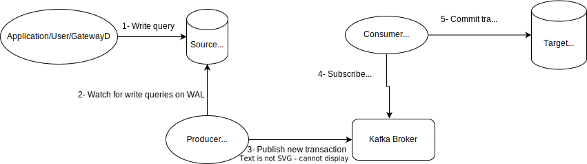

# Change Data Capture

## 1. Names

- **gatewayd-plugin-cdc**

## 2. Pitch

The proposed "CDC" plugin aims to facilitate a seamless migration process, allowing users to transition from one database instance to another with minimal disruption to production environments.

## 3. Idea

When migrating a database on production, a reasonable approach is to run another instance, synchronize it with the existing database, and have a tool in between that keeps these two databases in sync for a desired period without affecting performance considerably.

An advanced approach involves keeping databases synchronized even for direct requests, necessitating the comparison of Write-Ahead Logs (WALs) and duplicating transactions in the second database.

We want to implement this tool as a plugin of GatewayD, focusing on implementing this feature on PostgreSQL.

## 4. OSS Features

- **Compatibility:** Initially designed for PostgreSQL instances.
- **WAL Comparison:** Use Write-Ahead Logs of the source database and replicate the logs in the target database.

## 5. Paid Features

- **Compatibility:** Extend compatibility to other database pairs.
- **More Seamless:** The user only specifies the source and target database, and we will handle the rest; no need to set up Kafka or anything by the user.

## 6. Category

- Community
- Enterprise

## 7. Implementation Approaches

Based on [this article](https://medium.com/@ramesh.esl/change-data-capture-cdc-in-postgresql-7dee2d467d1b), we need to support three steps to be implemented.

1. **Capture change data**
2. **Transform change data into a format your destination database supports for upload**
3. **Upload the data to the destination database**

### Approach 1: Creating a copy of each write query inside and execute it asynchronously on the target database

In this approach, we create a database with exactly the same data as the current database, sync them, and start replicating queries from a point when both databases have the same state. Queries are queued in Kafka/RabbitMQ/Redis for repeatability in case of failures.

Advantages:
- Easy to implement.

Disadvantages:
- Potential delay in syncing databases under heavy load.
- Lack of control over non-GatewayD queries, risking desync.

### Approach 2: Using PostgreSQL built-in logical replication feature for publication and subscription

Based on [this article](https://datacater.io/blog/2021-09-02/postgresql-cdc-complete-guide.html), this approach involves creating a publication on a table and a subscription to another table.

Advantages:
- Real-time event-driven capturing of data changes.
- Detection of all change event types: INSERTs, UPDATEs, and DELETES.
- Low impact on PostgreSQL performance.

Disadvantages:
- Not supported by very old PostgreSQL versions (older than 9.4).

Open source tools like [Debezium](https://github.com/debezium/debezium) use this feature, publishing changes to Kafka topics. Steps to use Debezium include configuring PostgreSQL, starting Kafka, starting Debezium, and implementing a Kafka consumer.

This image shows a high-level design of the system implemented in this approach.

For the subscriber/consumer part, we can try using the [Confluent PostgreSQL sink connector](https://docs.confluent.io/cloud/current/connectors/cc-postgresql-sink.html), and if there are any problems in the scale with this connector, we can consider replacing it with our in-house consumer in the future.

### Approach 3: Implement our publisher and subscriber in Go, using the PostgreSQL's logical replication
In this approach, we will implement something similar to Debezium server/engine, but using Golang libraries such as [wal2json](https://github.com/eulerto/wal2json) and [wal-g](https://github.com/wal-g/wal-g).
The steps in this approach would be:
1. Using Wal-g, we create a base backup of the source database and restore it to the target database. From this point, the target database must be in read-only mode for users other than our plugin user.
2. Using wal2json, we create a stream of transactions from the source database from the point that the base backup was created.
3. A consumer reads the stream and applies the transactions to the target database.
4. From some point, we determine that the target database is somehow in sync with the source database, by somehow, I mean that there are less than a threshold number of transactions in the queue. At this point, we can say that databases are 'ready' for migration.
5. When databases are 'ready', and the user confirms, we need to put the source database in read-only mode and the consumer should process the remaining transactions until nothing is remaining.
   
   During the time that the consumer is applying the remaining transaction, and the source DB is in read-only mode, there might be some write queries coming to the database. I can think of two ways to handle these queries:
   1. Reject the queries and return an error to the client.
        This approach will cause a very short glitch and downtime, but according to the fact that we already know that very few transactions remain, this downtime will be very short.
    
   2. Make the write queries wait until the migration is done.
      Again, based on the fact that the number of remaining transactions is very low, this approach will make sure are queries are processed and responded to but it may take a bit longer than the regular response time.
6. In this step, we have completely migrated to the target database and the source database can be removed from the system.

## 8. Selected Approach
TBD